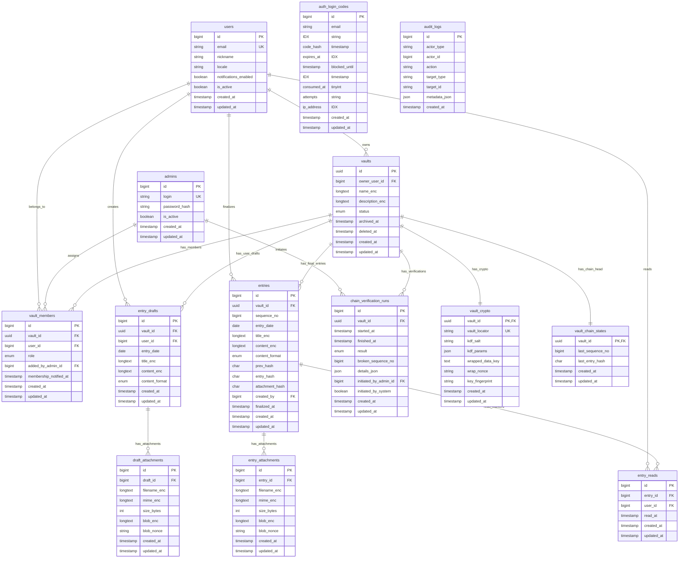

# Cryptosik ERD

## Overview
This ERD reflects the current Laravel implementation for Cryptosik.
It focuses on append-only entries, encrypted payload storage, per-user unread tracking, vault key lookup, and admin-managed access.

## Mermaid

## Important Constraints
- `vault_members (vault_id, user_id)` is unique.
- `entry_drafts (vault_id, user_id)` is unique.
- `entries (vault_id, sequence_no)` is unique.
- `entries (vault_id, entry_hash)` is unique.
- `entry_reads (entry_id, user_id)` is unique.
- `vault_crypto.vault_locator` is unique and used for vault lookup by key.

## Security Notes
- Encrypted text fields store ciphertext+nonce as JSON envelopes.
- Binary file payloads (`blob_enc`) are encrypted and stored as base64 text.
- Final entry history is integrity-protected by `prev_hash` and `entry_hash`.
- Notification and digest audit metadata stores only non-sensitive operational values.
